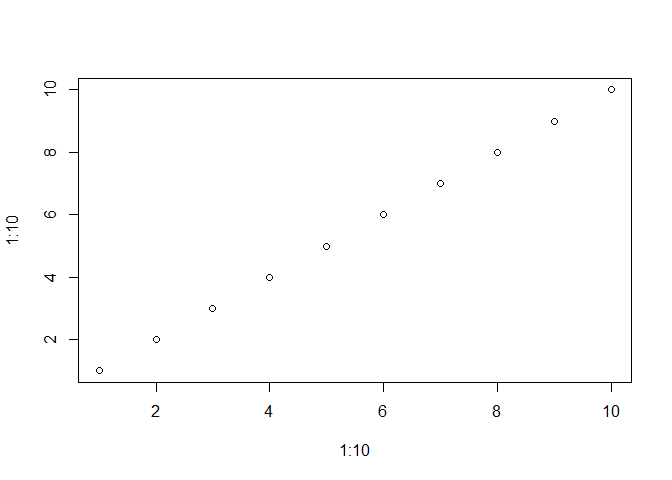

Class6RFunction
================
zqh
April 18, 2019

### About

This is my **class 6** r markdown document with my *code* and notes for the day.

``` r
plot(1:10, 1:10)
```



Read file practice
------------------

### text1

``` r
read.csv("test1.txt", header=TRUE, sep = ",")
```

    ##   Col1 Col2 Col3
    ## 1    1    2    3
    ## 2    4    5    6
    ## 3    7    8    9
    ## 4    a    b    c

### text2

``` r
read.csv("test2.txt", header=TRUE, sep = "$")
```

    ##   Col1 Col2 Col3
    ## 1    1    2    3
    ## 2    4    5    6
    ## 3    7    8    9
    ## 4    a    b    c

### text3

``` r
read.csv("test3.txt", header = FALSE, sep = "")
```

    ##   V1 V2 V3
    ## 1  1  6  a
    ## 2  2  7  b
    ## 3  3  8  c
    ## 4  4  9  d
    ## 5  5 10  e

``` r
philCheck <- function(x,y,z){
result <- (x|(y|z))
return (result)

}

philCheck(TRUE, FALSE, FALSE)
```

    ## [1] TRUE

``` r
rescale <- function(x, na.rm=TRUE, plot = TRUE){
  rng <- range(x, na.rm = na.rm)
  print ("Hello")
  answer <-(x-rng[1])/(rng[2]-rng[1])
  print ("is it me you are looking for?")
  if(plot){
    plot(answer, type = "b", lwd=4)
  }
  print("I can see it in")
  return(answer)
  
}

rescale(1:10)
```

    ## [1] "Hello"
    ## [1] "is it me you are looking for?"


    ## [1] "I can see it in"

    ##  [1] 0.0000000 0.1111111 0.2222222 0.3333333 0.4444444 0.5555556 0.6666667
    ##  [8] 0.7777778 0.8888889 1.0000000
