class08
================
zqh
April 25, 2019

``` r
tmp <- c(rnorm(30,-1), rnorm(30,1))
x <- cbind(x=tmp, y=rev(tmp))

##kmeans

km<-kmeans(x, centers = 2, nstart = 20)
palette(c("red", "grey"))

plot(x,col = km$cluster )
# 30 in each cluster
#membership is recorded in clustering vector
#cluster center at cluster means: (-2.94, 2.98) and (2.99, -2.94)
par(new=TRUE)
points(km$centers, pch=18, col = "blue", cex=3)
```

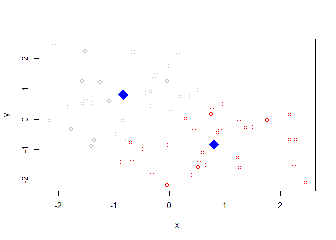

``` r
##hierarchical clustering
dist_matrix <- dist(x)
hc <- hclust(d=dist_matrix)
plot(hc)

abline(h=6, col="red")
```

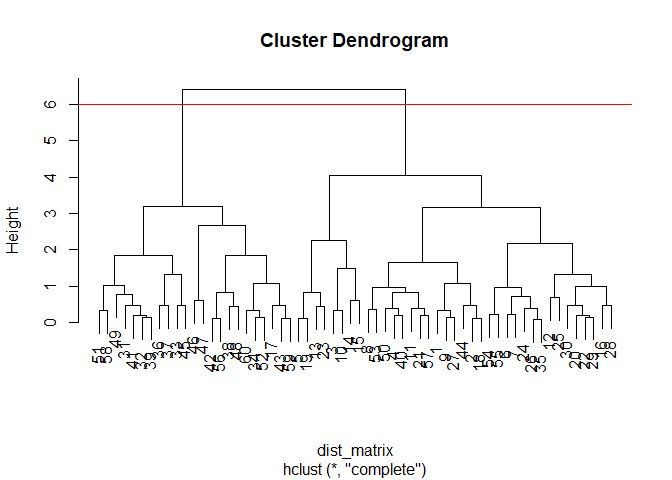

``` r
#cut by height
plot (x, col = cutree(hc, k=2))
```

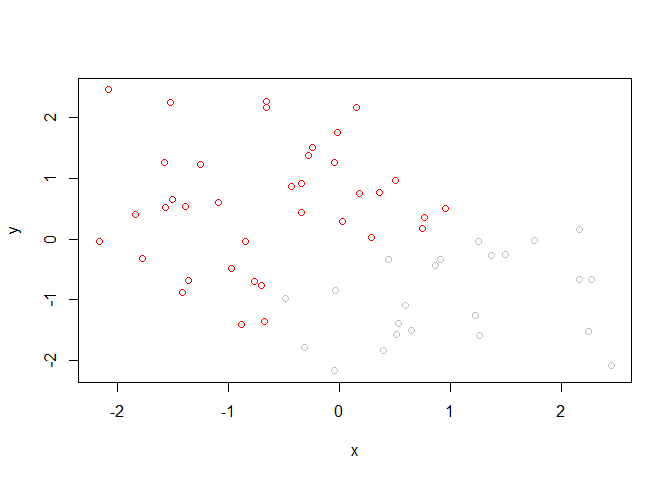

``` r
#cut by cluster: cutree(hc, k=n)
```

``` r
# Step 1. Generate some example data for clustering
x <- rbind(
 matrix(rnorm(100, mean=0, sd = 0.3), ncol = 2), # c1
 matrix(rnorm(100, mean = 1, sd = 0.3), ncol = 2), # c2
 matrix(c(rnorm(50, mean = 1, sd = 0.3), # c3
 rnorm(50, mean = 0, sd = 0.3)), ncol = 2))
colnames(x) <- c("x", "y")
# Step 2. Plot the data without clustering
plot(x)
```

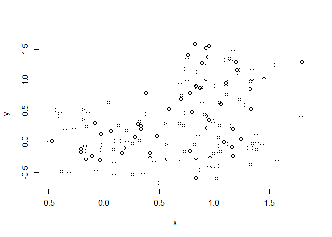

``` r
# Step 3. Generate colors for known clusters
# (just so we can compare to hclust results)
col <- as.factor( rep(c("c1","c2","c3"), each=50) )
plot(x, col=col)
```

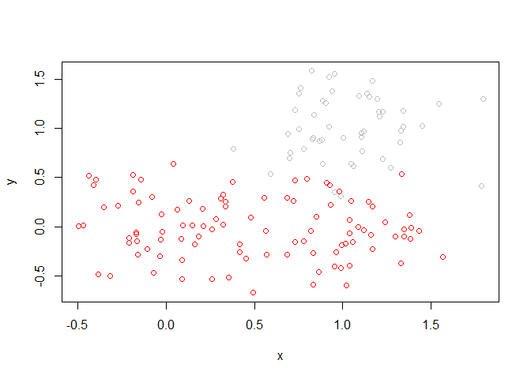

``` r
palette(c("red", "blue", "green"))

dist2 <- dist(x)
hc2 <- hclust(dist2)
plot(hc2)
```

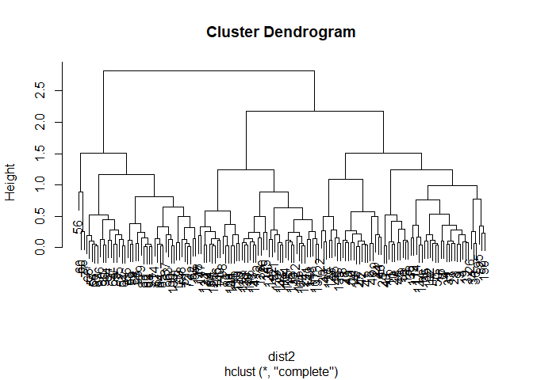

``` r
plot(x, col=cutree(hc2, k=2),main = "hc k=2")
```

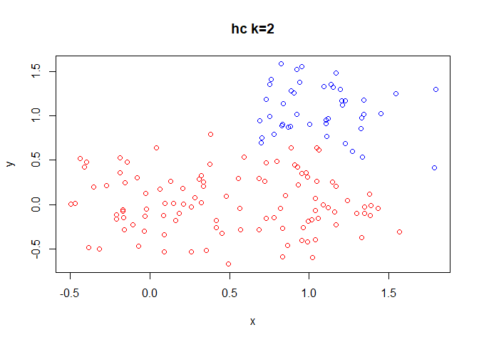

``` r
plot(x, col=cutree(hc2, k=3),main = "hc k=3")
```

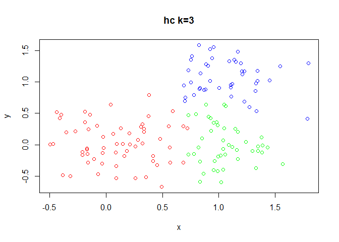

``` r
mydata <- read.csv("https://tinyurl.com/expression-CSV",
 row.names=1) 
pca <- prcomp(t(mydata), scale=TRUE)
attributes(pca)
```

    ## $names
    ## [1] "sdev"     "rotation" "center"   "scale"    "x"       
    ## 
    ## $class
    ## [1] "prcomp"

``` r
colvec <- colnames(mydata)
#assign color
colvec[grep("wt", colvec)] <-"red"
colvec[grep("ko",colvec)] <-"blue"
#variant 
pca.var <- pca$sdev^2
#percent variant
pca.var.per <- round(pca.var/sum(pca.var)*100,1)

#plot
plot(pca$x[,1], pca$x[,2], col=colvec, 
     xlab=paste0("PC1 (", pca.var.per[1], "%)"),
    ylab=paste0("PC2 (", pca.var.per[2], "%)")) 
```

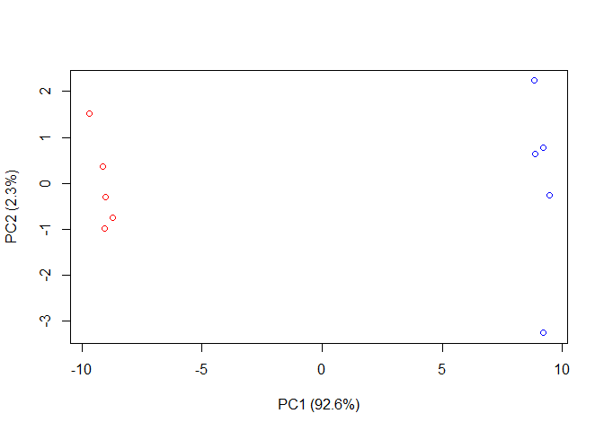

``` r
uk <- read.csv("UK_foods.csv", header = TRUE, sep=",")
rownames(uk)<-uk[,1]
uk <- uk[,-1]
#barplot
barplot(as.matrix(uk), beside=F, col=rainbow(17))
```


``` r
 #pca
 pca2 <- prcomp(t(uk))
 summary(pca2)
```

    ## Importance of components:
    ##                             PC1      PC2      PC3       PC4
    ## Standard deviation     324.1502 212.7478 73.87622 4.189e-14
    ## Proportion of Variance   0.6744   0.2905  0.03503 0.000e+00
    ## Cumulative Proportion    0.6744   0.9650  1.00000 1.000e+00

``` r
 plot(pca2$x[,1],pca2$x[,2], xlab="PC1", ylab="PC2", xlim = c(-270,500))
 text(pca2$x[,1],pca2$x[,2],colnames(uk),col=rainbow(4))
```

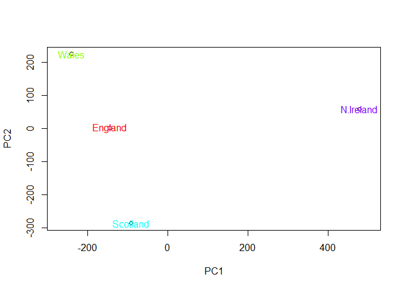

``` r
 #percent variance
 v_uk <- round(pca2$sdev^2/sum(pca2$sdev^2)*100)
 
 z<-summary(pca)
 z$importance
```

    ##                             PC1      PC2      PC3      PC4       PC5
    ## Standard deviation     9.623734 1.519849 1.057866 1.052033 0.8806163
    ## Proportion of Variance 0.926160 0.023100 0.011190 0.011070 0.0077500
    ## Cumulative Proportion  0.926160 0.949260 0.960450 0.971520 0.9792800
    ##                              PC6       PC7       PC8       PC9
    ## Standard deviation     0.8254517 0.8011116 0.6206451 0.6034223
    ## Proportion of Variance 0.0068100 0.0064200 0.0038500 0.0036400
    ## Cumulative Proportion  0.9860900 0.9925100 0.9963600 1.0000000
    ##                                PC10
    ## Standard deviation     3.348364e-15
    ## Proportion of Variance 0.000000e+00
    ## Cumulative Proportion  1.000000e+00

``` r
 barplot (v_uk, xlab = "principle component", ylab = "percent variation")
```

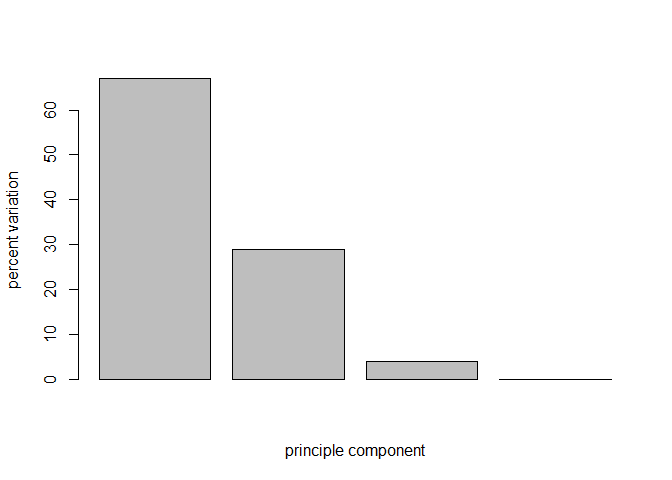

``` r
 ## Lets focus on PC1 as it accounts for > 90% of variance 
par(mar=c(10, 3, 0.35, 0))
barplot( pca2$rotation[,1], las=2 )
```


