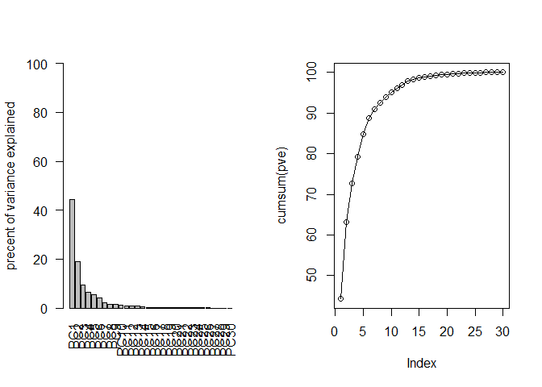
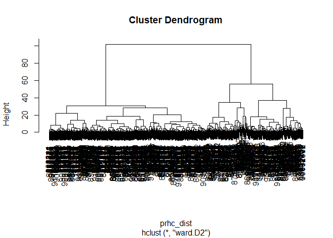
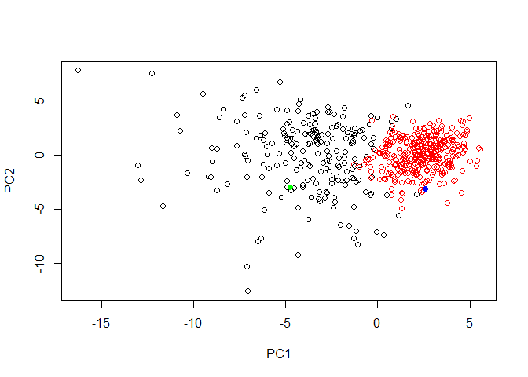

class09
================
zqh
April 30, 2019

``` r
#read data
wisc.df <- read.csv("https://bioboot.github.io/bimm143_W18/class-material/WisconsinCancer.csv")
#convert to matrix
wisc.data <- as.matrix(wisc.df[,3:32])
#assign id names to wisc.data rows
rownames(wisc.data)<-wisc.df$id
#diagnosis 1 if M, 0 otherwise
diagnosis <- as.numeric(wisc.df$diagnosis =="M")
```

``` r
#Q1. How many observations are in this dataset?
paste0("There are ",nrow(wisc.df)," observations")
```

    ## [1] "There are 569 observations"

``` r
#Q2. How many variables/features in the data are suffixed with _mean?
paste0("There are ", length(grep("mean",colnames(wisc.data))), " variables suffixed with _mean")
```

    ## [1] "There are 10 variables suffixed with _mean"

``` r
#Q3. How many of the observations have a malignant diagnosis?
paste0("There are ", sum(diagnosis), " malignant diagnosis")
```

    ## [1] "There are 212 malignant diagnosis"

### PCA prep

``` r
colMeans(wisc.data)
```

    ##             radius_mean            texture_mean          perimeter_mean 
    ##            1.412729e+01            1.928965e+01            9.196903e+01 
    ##               area_mean         smoothness_mean        compactness_mean 
    ##            6.548891e+02            9.636028e-02            1.043410e-01 
    ##          concavity_mean     concave.points_mean           symmetry_mean 
    ##            8.879932e-02            4.891915e-02            1.811619e-01 
    ##  fractal_dimension_mean               radius_se              texture_se 
    ##            6.279761e-02            4.051721e-01            1.216853e+00 
    ##            perimeter_se                 area_se           smoothness_se 
    ##            2.866059e+00            4.033708e+01            7.040979e-03 
    ##          compactness_se            concavity_se       concave.points_se 
    ##            2.547814e-02            3.189372e-02            1.179614e-02 
    ##             symmetry_se    fractal_dimension_se            radius_worst 
    ##            2.054230e-02            3.794904e-03            1.626919e+01 
    ##           texture_worst         perimeter_worst              area_worst 
    ##            2.567722e+01            1.072612e+02            8.805831e+02 
    ##        smoothness_worst       compactness_worst         concavity_worst 
    ##            1.323686e-01            2.542650e-01            2.721885e-01 
    ##    concave.points_worst          symmetry_worst fractal_dimension_worst 
    ##            1.146062e-01            2.900756e-01            8.394582e-02

``` r
apply(wisc.data,2,sd)
```

    ##             radius_mean            texture_mean          perimeter_mean 
    ##            3.524049e+00            4.301036e+00            2.429898e+01 
    ##               area_mean         smoothness_mean        compactness_mean 
    ##            3.519141e+02            1.406413e-02            5.281276e-02 
    ##          concavity_mean     concave.points_mean           symmetry_mean 
    ##            7.971981e-02            3.880284e-02            2.741428e-02 
    ##  fractal_dimension_mean               radius_se              texture_se 
    ##            7.060363e-03            2.773127e-01            5.516484e-01 
    ##            perimeter_se                 area_se           smoothness_se 
    ##            2.021855e+00            4.549101e+01            3.002518e-03 
    ##          compactness_se            concavity_se       concave.points_se 
    ##            1.790818e-02            3.018606e-02            6.170285e-03 
    ##             symmetry_se    fractal_dimension_se            radius_worst 
    ##            8.266372e-03            2.646071e-03            4.833242e+00 
    ##           texture_worst         perimeter_worst              area_worst 
    ##            6.146258e+00            3.360254e+01            5.693570e+02 
    ##        smoothness_worst       compactness_worst         concavity_worst 
    ##            2.283243e-02            1.573365e-01            2.086243e-01 
    ##    concave.points_worst          symmetry_worst fractal_dimension_worst 
    ##            6.573234e-02            6.186747e-02            1.806127e-02

### PCA

``` r
wisc.pr <- prcomp(x = wisc.data,scale. = TRUE)
summary(wisc.pr)
```

    ## Importance of components:
    ##                           PC1    PC2     PC3     PC4     PC5     PC6
    ## Standard deviation     3.6444 2.3857 1.67867 1.40735 1.28403 1.09880
    ## Proportion of Variance 0.4427 0.1897 0.09393 0.06602 0.05496 0.04025
    ## Cumulative Proportion  0.4427 0.6324 0.72636 0.79239 0.84734 0.88759
    ##                            PC7     PC8    PC9    PC10   PC11    PC12
    ## Standard deviation     0.82172 0.69037 0.6457 0.59219 0.5421 0.51104
    ## Proportion of Variance 0.02251 0.01589 0.0139 0.01169 0.0098 0.00871
    ## Cumulative Proportion  0.91010 0.92598 0.9399 0.95157 0.9614 0.97007
    ##                           PC13    PC14    PC15    PC16    PC17    PC18
    ## Standard deviation     0.49128 0.39624 0.30681 0.28260 0.24372 0.22939
    ## Proportion of Variance 0.00805 0.00523 0.00314 0.00266 0.00198 0.00175
    ## Cumulative Proportion  0.97812 0.98335 0.98649 0.98915 0.99113 0.99288
    ##                           PC19    PC20   PC21    PC22    PC23   PC24
    ## Standard deviation     0.22244 0.17652 0.1731 0.16565 0.15602 0.1344
    ## Proportion of Variance 0.00165 0.00104 0.0010 0.00091 0.00081 0.0006
    ## Cumulative Proportion  0.99453 0.99557 0.9966 0.99749 0.99830 0.9989
    ##                           PC25    PC26    PC27    PC28    PC29    PC30
    ## Standard deviation     0.12442 0.09043 0.08307 0.03987 0.02736 0.01153
    ## Proportion of Variance 0.00052 0.00027 0.00023 0.00005 0.00002 0.00000
    ## Cumulative Proportion  0.99942 0.99969 0.99992 0.99997 1.00000 1.00000

``` r
print("44.27% variation is captured by pc1")
```

    ## [1] "44.27% variation is captured by pc1"

``` r
print("3 PCs are required to describe 70% variance")
```

    ## [1] "3 PCs are required to describe 70% variance"

``` r
print("7 PCs are required to describe 90% variance")
```

    ## [1] "7 PCs are required to describe 90% variance"

``` r
plot(wisc.pr$x[,1],wisc.pr$x[,2], col=diagnosis+1, 
     xlab = "PC1", ylab = "PC2")
```


``` r
plot(wisc.pr$x[,c(1,3)], col=diagnosis +1,
     xlab="PC1", ylab="PC3")
```


``` r
biplot(wisc.pr)
```


``` r
print("PC1PC2 plot is more spread out than PC1PC3 plot")
```

    ## [1] "PC1PC2 plot is more spread out than PC1PC3 plot"

``` r
par(mfcol=c(1,2))
pr_var <- wisc.pr$sdev^2
pve<-(pr_var/sum(pr_var))*100

barplot(pve,ylab= "precent of variance explained",
        names.arg=paste0("PC",1:length(pve)), las=2, ylim = c(0,100))
plot(cumsum(pve), type="o")
```



``` r
#dist <- dist(wisc.pr$x[,c(1,2)])
#tree <-hclust(dist)
#wisc.hclust.clusters <- cutree(tree = tree,k = 4)
#table(wisc.hclust.clusters,diagnosis)

data.scaled <-scale(wisc.data)
data.dist <-dist(data.scaled)
wisc.hclust <- hclust(data.dist)
cut <- cutree(tree = wisc.hclust, k=4)

plot(wisc.hclust)
abline(h = 19, col="red", lty=2)
```


``` r
table(cut,diagnosis)
```

    ##    diagnosis
    ## cut   0   1
    ##   1  12 165
    ##   2   2   5
    ##   3 343  40
    ##   4   0   2

``` r
wisc.km <-kmeans(data.scaled, centers=2, nstart=20)
k_table <-as.matrix(table(wisc.km$cluster, diagnosis))
k_table
```

    ##    diagnosis
    ##       0   1
    ##   1  14 175
    ##   2 343  37

``` r
prhc <-wisc.pr$x[,1:7]
prhc_dist <- dist(prhc)
tree2 <- hclust(prhc_dist, method="ward.D2")
plot(tree2)
```



``` r
cut2 <-cutree(tree2, k=2)
h_table<-as.matrix(table(cut2, diagnosis))
h_table
```

    ##     diagnosis
    ## cut2   0   1
    ##    1  28 188
    ##    2 329  24

``` r
plot(wisc.pr$x[,1:2],col=cut2)
```


``` r
library(rgl)
plot3d(wisc.pr$x[,1:3], xlab = "PC1", ylab="PC2", zlab="PC3", cex=1.5, size=1, type="s", col=diagnosis+1)
```

### sensitivity and specificity

``` r
k_table
```

    ##    diagnosis
    ##       0   1
    ##   1  14 175
    ##   2 343  37

``` r
h_table
```

    ##     diagnosis
    ## cut2   0   1
    ##    1  28 188
    ##    2 329  24

``` r
#sensitivity
k_sens <- k_table[1,2]/sum(k_table[,2])
h_sens <- h_table[1,2]/sum(h_table[,2])
k_sens<h_sens
```

    ## [1] TRUE

``` r
#specificity
k_spe <- k_table[2,1]/sum(k_table[,1])
h_spe<- h_table[2,1]/sum(h_table[,1])
k_spe < h_spe
```

    ## [1] FALSE

Prediction
----------

``` r
new <-read.csv("https://tinyurl.com/new-samples-CSV")
npc<-predict(wisc.pr,newdata=new)
npc
```

    ##            PC1       PC2        PC3        PC4       PC5        PC6
    ## [1,]  2.576616 -3.135913  1.3990492 -0.7631950  2.781648 -0.8150185
    ## [2,] -4.754928 -3.009033 -0.1660946 -0.6052952 -1.140698 -1.2189945
    ##             PC7        PC8       PC9       PC10      PC11      PC12
    ## [1,] -0.3959098 -0.2307350 0.1029569 -0.9272861 0.3411457  0.375921
    ## [2,]  0.8193031 -0.3307423 0.5281896 -0.4855301 0.7173233 -1.185917
    ##           PC13     PC14      PC15       PC16        PC17        PC18
    ## [1,] 0.1610764 1.187882 0.3216974 -0.1743616 -0.07875393 -0.11207028
    ## [2,] 0.5893856 0.303029 0.1299153  0.1448061 -0.40509706  0.06565549
    ##             PC19       PC20       PC21       PC22       PC23       PC24
    ## [1,] -0.08802955 -0.2495216  0.1228233 0.09358453 0.08347651  0.1223396
    ## [2,]  0.25591230 -0.4289500 -0.1224776 0.01732146 0.06316631 -0.2338618
    ##             PC25         PC26         PC27        PC28         PC29
    ## [1,]  0.02124121  0.078884581  0.220199544 -0.02946023 -0.015620933
    ## [2,] -0.20755948 -0.009833238 -0.001134152  0.09638361  0.002795349
    ##              PC30
    ## [1,]  0.005269029
    ## [2,] -0.019015820

``` r
plot(wisc.pr$x[,1:2], col=cut2)
points(npc[,1],npc[,2],col=c("blue","green"),pch=16)
```



``` r
print("prioritize second patient")
```

    ## [1] "prioritize second patient"
