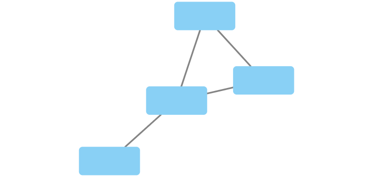
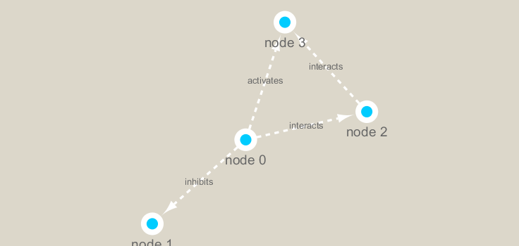

```{r setup, include=FALSE}
knitr::opts_chunk$set(echo = TRUE)
```
```{r}
library(igraph)
library(RCy3)
library(RColorBrewer)
```

```{r}

cytoscapePing()
```

```{r}
g <- makeSimpleIgraph()
createNetworkFromIgraph(g,"myGraph")
```
```{r}
fig <- exportImage(filename = "demo", type="png", height=350)

```

```{r}
setVisualStyle("Marquee")
fig <-exportImage(filename="demo_marquee", type="png", height=350)

```

```{r}
prok_vir_cor <- read.delim("virus_prok_cor_abundant.tsv", stringsAsFactors = FALSE)
head(prok_vir_cor)
g<- graph.data.frame(prok_vir_cor, directed = FALSE)
g
```

```{r}
plot(g, vertex.label=NA)
```
```{r}
cb <- cluster_edge_betweenness(g)
```
```{r}
plot(cb, y=g, vertex.label=NA, vertex.size=3)
```
```{r}
head(membership(cb))
```

```{r}
d <- degree(g)
hist(d, breaks=30, col="lightblue")
```
```{r}
library(BBmisc)
pr <- page_rank(g)
v.size<- BBmisc::normalize(pr$vector, range=c(2,20),method="range")
plot(g, vertex.size=v.size, vertex.label=NA)
```
 
```{r}
b <- betweenness(g)
v.size <- BBmisc::normalize(b, range=c(2,20), method="range")
plot(g, vertex.size=v.size, vertex.label=NA)

```
 
```{r}
phage_id_affiliation <- read.delim("phage_ids_with_affiliation.tsv")
bac_id_affi <- read.delim("prok_tax_from_silva.tsv", stringsAsFactors=FALSE)
```

```{r}
genenet.nodes <- as.data.frame(vertex.attributes(g), stringsAsFactors = FALSE)
```

```{r}
z <- bac_id_affi[,c("Accession_ID", "Kingdom", "Phylum", "Class")]
n <- merge(genenet.nodes, z, by.x="name", by.y="Accession_ID", all.x=TRUE)
```

```{r}
# Again we only need a subset of `phage_id_affiliation` for our purposes
y <- phage_id_affiliation[, c("first_sheet.Phage_id_network", "phage_affiliation","Tax_order", "Tax_subfamily")]

# Add the little phage annotation that we have
x <- merge(x=n, y=y, by.x="name", by.y="first_sheet.Phage_id_network", all.x=TRUE)

## Remove duplicates from multiple matches
x <- x[!duplicated( (x$name) ),]
head(x)
genenet.nodes<-x
```
 
```{r}
deleteAllNetworks()
```
 
```{r}
colnames(genenet.nodes)[1]<-"id"
genenet.edges <-data.frame(igraph::as_edgelist(g))
colnames(genenet.edges) <-c("source", "target")
genenet.edges$Weight<-igraph::edge_attr(g)$weight
createNetworkFromDataFrames(genenet.nodes,genenet.edges,title="Tara_Oceans")
```
 
 